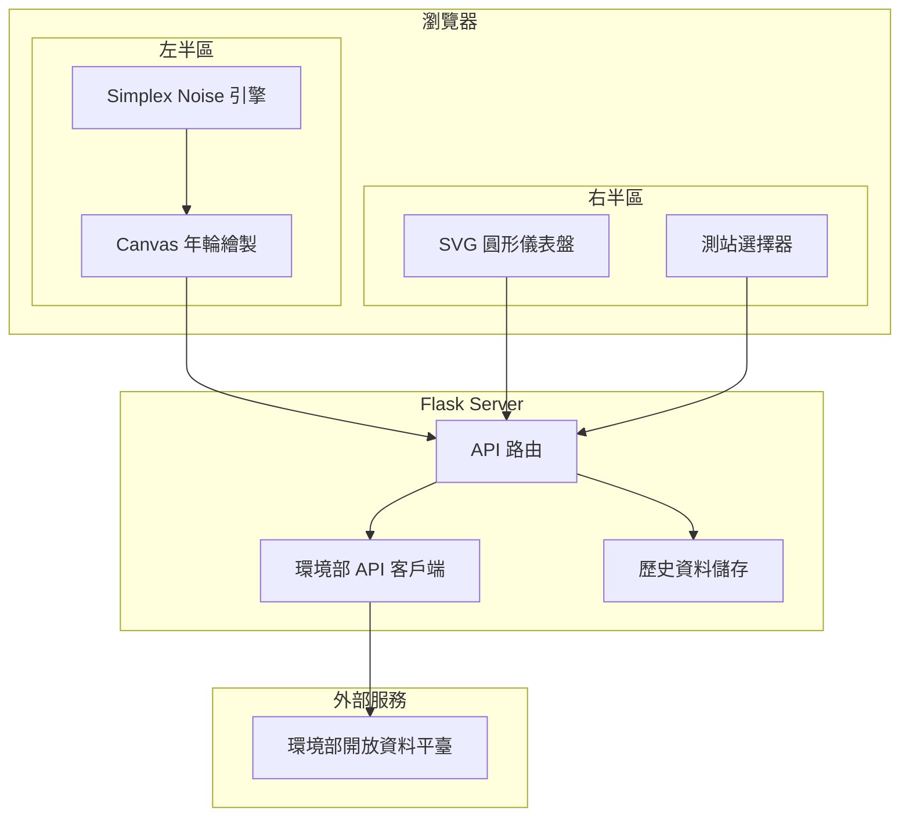

# City Breath 城市的呼吸

[](https://www.gnu.org/licenses/agpl-3.0)
[](https://python.org/)
[](https://flask.palletsprojects.com/)

[← 回到 Muripo HQ](https://tznthou.github.io/muripo-hq/) | [English](README_EN.md)

將空氣品質數據轉化為有機年輪的視覺化藝術。每一圈年輪都是城市呼吸的痕跡，紀錄了我們共同呼吸的歷史。


> **「也許空氣看不見，但它的故事可以被看見。」**

---

## 功能特色

- **年輪視覺化**：24 圈年輪代表過去 24 小時的空氣品質
- **有機扭曲**：PM2.5 濃度越高，年輪越扭曲（Simplex Noise 演算法）
- **即時儀表盤**：SVG 圓形儀表盤顯示 AQI、PM2.5、PM10、O₃ 即時數據
- **即時監測**：每 5 分鐘自動更新環境部 AQI 數據
- **測站切換**：支援全台 88 個空氣品質監測站
- **色彩映射**：六級 AQI 顏色對照，一目了然
- **極簡設計**：純白背景、50/50 分割佈局，讓數據說話
- **資料累積**：自動儲存歷史數據，逐步替換模擬資料

---

## 數據美學映射

| 視覺元素 | 數據來源 | 映射邏輯 |
|---------|---------|---------|
| **半徑** | 時間 | 中心 = 現在，外圈 = 過去 |
| **顏色** | AQI 值 | 綠 → 黃 → 橘 → 紅 → 紫 → 褐 |
| **扭曲度** | PM2.5 | 濃度越高，年輪越不規則 |
| **線條粗細** | AQI 值 | 數值越高，線條越粗 |
| **透明度** | 時間 | 越舊的年輪越淡 |

---

## AQI 顏色對照

| 等級 | AQI 範圍 | 顏色 | 狀態 |
|------|---------|------|------|
| 良好 | 0-50 | 🟢 綠色 | 空氣品質良好 |
| 普通 | 51-100 | 🟡 黃色 | 可接受 |
| 對敏感族群不健康 | 101-150 | 🟠 橘色 | 敏感族群注意 |
| 對所有族群不健康 | 151-200 | 🔴 紅色 | 減少戶外活動 |
| 非常不健康 | 201-300 | 🟣 紫色 | 避免戶外活動 |
| 危害 | 301+ | 🟤 褐紅 | 緊急狀態 |

---

## 系統架構



---

## 技術棧

| 技術 | 用途 | 備註 |
|------|------|------|
| Python 3.11+ | 後端執行環境 | 使用 uv 管理 |
| Flask 3.0 | Web 框架 | API 代理 |
| Canvas API | 年輪繪製 | 原生 JavaScript |
| Simplex Noise | 有機扭曲效果 | 自實作 |
| Tailwind CSS 3.4 | UI 樣式 | CDN 載入 |

---

## 快速開始

### 環境需求

- Python 3.11+
- [環境部 API Key](https://data.moenv.gov.tw/api_term)（免費申請）

### 安裝步驟

```bash
# 進入專案目錄
cd day-23-city-breath

# 安裝依賴
uv sync

# 設定環境變數
cp .env.example .env
# 編輯 .env，填入你的 API Key

# 啟動開發伺服器
uv run python -m src.app
```

開啟瀏覽器訪問 `http://localhost:5000`

### 環境變數

```env
# 環境部 API Key（必填）
MOENV_API_KEY=your-api-key-here

# 伺服器設定
PORT=5000
DEBUG=false

# 預設測站（可選：板橋、松山、中山、萬華 等）
DEFAULT_STATION=板橋
```

---

## API 端點

| 端點 | 方法 | 說明 |
|------|------|------|
| `/` | GET | 主頁面 |
| `/api/stations` | GET | 取得所有測站列表 |
| `/api/aqi?station=臺北` | GET | 取得指定測站即時 AQI |
| `/api/history?station=臺北&hours=24` | GET | 取得歷史資料 |
| `/api/health` | GET | 健康檢查 |

---

## 專案結構

```
day-23-city-breath/
├── src/
│   ├── __init__.py
│   ├── app.py              # Flask 主程式
│   ├── aqi_client.py       # 環境部 API 客戶端
│   └── data_store.py       # 歷史資料儲存
├── templates/
│   └── index.html          # 主頁面模板（50/50 分割佈局）
├── static/
│   ├── css/
│   │   └── main.css        # 主樣式（極簡白色主題）
│   └── js/
│       ├── noise.js        # Simplex Noise 實作
│       ├── rings.js        # 年輪繪製引擎
│       └── app.js          # 前端主程式 + SVG 儀表盤
├── data/                    # 歷史資料儲存
├── assets/                  # Demo 圖片
├── pyproject.toml          # Python 依賴設定
├── uv.lock                 # 依賴鎖定檔
├── Procfile                # Zeabur 部署設定
├── .env.example
├── README.md
├── README_EN.md
└── LICENSE
```

---

## 安全性與程式碼品質

本專案經過完整的 Code Review，實作了以下防護措施：

### 安全性強化

| 措施 | 說明 |
|------|------|
| CSP 內容安全政策 | Flask-Talisman 設定 script-src、style-src 等防止 XSS |
| Rate Limiting | API 限流（10-30 req/min）防止濫用攻擊 |
| Path Traversal 防護 | 測站名稱正則驗證 + 路徑包含檢查 |
| 參數驗證 | 所有 API 參數安全解析與範圍檢查 |
| 統一錯誤處理 | 生產環境隱藏內部錯誤細節 |
| XSS 防護 | 前端 `escapeHtml()` 轉義使用者輸入 |
| HTTPS 強制 | 生產環境自動啟用 HSTS |

### 可靠性改進

| 措施 | 說明 |
|------|------|
| API 快取 | 5 分鐘 TTL，失敗時返回過期快取 |
| 原子性寫入 | 歷史資料使用 temp file + move 確保完整性 |
| JSON 安全解析 | Content-Type 驗證 + JSONDecodeError 處理 |

### 效能優化

| 措施 | 說明 |
|------|------|
| 幀率控制 | Canvas 動畫限制 30 FPS 節省電量 |
| Resize Debounce | 視窗調整事件 150ms 防抖動 |
| 資源清理 | 頁面卸載時清除定時器防止記憶體洩漏 |

---

## 部署到 Zeabur

### 步驟 1：建立專案

1. 登入 [Zeabur](https://zeabur.com/)
2. 建立新專案

### 步驟 2：部署服務

1. 選擇「Git」部署方式
2. 連接你的 GitHub Repository
3. 選擇此專案資料夾

### 步驟 3：設定環境變數

在 Zeabur 的環境變數設定中加入：

```
MOENV_API_KEY=your-api-key
DEFAULT_STATION=板橋
```

### 步驟 4：設定網域

1. 進入服務設定
2. 在「Networking」新增網域
3. 可使用免費的 `.zeabur.app` 子網域

### 常見問題：找不到 main.py

如果部署後看到錯誤：

```
/app/.venv/bin/python3: can't open file '/app/main.py': [Errno 2] No such file or directory
```

這是因為 Zeabur 預設會找 `main.py` 作為入口點，而不是讀取 `Procfile`。

**解決方法**：確保專案根目錄有 `main.py`：

```python
from src.app import app

if __name__ == "__main__":
    import os
    port = int(os.getenv("PORT", 5000))
    app.run(host="0.0.0.0", port=port)
```

---

## 隨想

### 看不見的呼吸

我們每天呼吸約兩萬次，卻很少意識到空氣的存在。

直到霧霾來襲，直到喉嚨發癢，直到窗外的風景變成一片灰濛——我們才想起，空氣不是理所當然的。

這個專案試圖讓「呼吸」變得可見。

### 年輪的隱喻

為什麼用年輪？

因為年輪是時間的記憶。一棵樹的年輪記錄了它經歷過的每一年——乾旱、雨季、蟲害、火災。寬的年輪代表豐年，窄的年輪代表災年。

城市的呼吸也是一樣。

每一小時的空氣品質，都是這座城市在那個時刻的狀態。好的時候，年輪圓潤平滑；壞的時候，年輪扭曲斷裂。

24 圈年輪，24 小時的記憶。

### 扭曲的美學

為什麼污染要用扭曲來表現？

因為污染本身就是一種「不自然」。

乾淨的空氣是圓的、順暢的、和諧的。污染打破了這種和諧，引入了混亂、噪點、不規則。

Perlin Noise 是一種「自然的隨機」——它不是純粹的混亂，而是有結構的混亂。就像真實世界的污染，不是均勻分佈的，而是隨風向、地形、時間變化的。

用 Perlin Noise 來表現污染，某種程度上是在用「自然」來諷刺「不自然」。

### 純白的選擇

為什麼用純白背景？

最初的設計是深色主題——賽博龐克的螢光、儀表盤的專業感。但最後選擇了極簡的純白。

因為白色就是乾淨空氣的顏色。

當你打開這個頁面，看到大片留白，你的第一個感覺應該是「清新」。這正是我們對空氣品質的期待。

純白背景讓年輪的顏色更加突出：綠色更綠，紅色更警示。沒有多餘的裝飾，沒有炫技的動畫，只有數據本身在說話。

極簡不是偷懶，而是一種態度——空氣應該是無色無味的，介面也應該是不打擾的。當空氣品質良好時，這個頁面應該讓你感覺什麼都沒發生；只有當年輪開始扭曲、顏色開始警示，你才需要關注。

白色也是一種脆弱。一點污漬就會被看見。這正是空氣的真相——我們以為看不見的東西，其實一直都在影響著我們。

### 給 Vibe Coder 的話

這個專案的核心很簡單：

1. 每小時抓一次 API
2. 把 AQI 映射成顏色
3. 把 PM2.5 映射成扭曲度
4. 用 Canvas 畫 24 個同心圓

複雜的是「如何讓數據有感覺」。

數字本身是冷的。35 和 55 的 PM2.5，差別只是兩個數字。但當 35 是一個圓潤的綠色年輪，55 是一個扭曲的黃色年輪——你會開始「感覺」到差異。

這就是數據視覺化的意義：不是讓人「讀懂」數據，而是讓人「感受」數據。

**Fork it. Breathe it. Make it yours.**

---

## 資料來源與授權

### 資料來源

本專案使用 [環境部環境資料開放平臺](https://data.moenv.gov.tw) 提供的空氣品質指標（AQI）資料。

- 資料集：[空氣品質指標(AQI)](https://data.moenv.gov.tw/dataset/detail/aqx_p_432)
- 更新頻率：每小時
- 授權條款：**CC BY 4.0**

使用本專案時，請標註資料來源：「資料來源：環境部環境資料開放平臺」

### 程式碼授權

本專案程式碼採用 [AGPL-3.0 License](LICENSE) 授權。

這意味著：
- ✅ 可自由使用、修改、散佈
- ✅ 可用於商業用途
- ⚠️ 修改後的程式碼必須以相同授權釋出
- ⚠️ 網路服務也需公開原始碼
