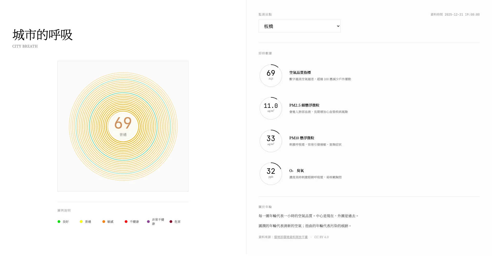
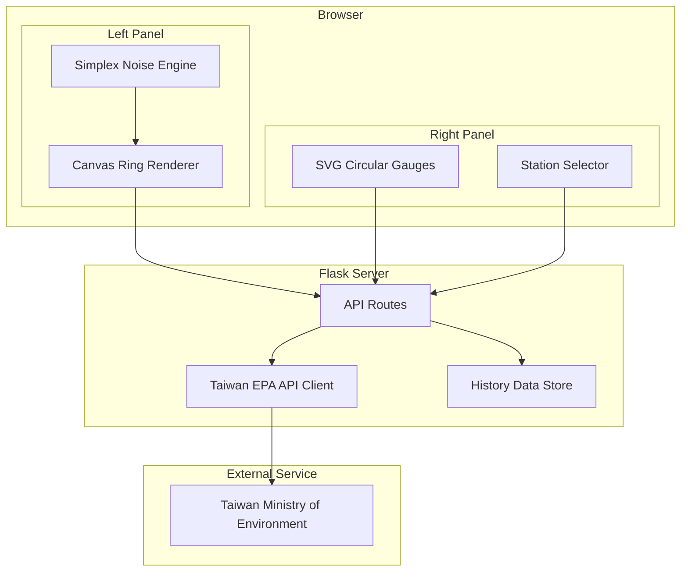

# City Breath

[](https://www.gnu.org/licenses/agpl-3.0)
[](https://python.org/)
[](https://flask.palletsprojects.com/)

[← Back to Muripo HQ](https://tznthou.github.io/muripo-hq/) | [中文](README.md)

Transforming air quality data into organic tree ring visualizations. Each ring is a trace of the city's breath, recording the history of the air we share.



> **"Perhaps air is invisible, but its story can be seen."**

---

## Features

- **Ring Visualization**: 24 rings representing 24 hours of air quality
- **Organic Distortion**: Higher PM2.5 = more distorted rings (Simplex Noise)
- **Real-time Dashboard**: SVG circular gauges displaying AQI, PM2.5, PM10, O₃ data
- **Real-time Monitoring**: Auto-updates every 5 minutes from Taiwan EPA
- **Station Switching**: Supports 88 air quality monitoring stations across Taiwan
- **Color Mapping**: Six-level AQI color coding at a glance
- **Minimalist Design**: Pure white background, 50/50 split layout, let data speak
- **Data Accumulation**: Auto-saves history, gradually replacing mock data

---

## Data-to-Visual Mapping

| Visual Element | Data Source | Mapping Logic |
|----------------|-------------|---------------|
| **Radius** | Time | Center = Now, Outer = Past |
| **Color** | AQI Value | Green → Yellow → Orange → Red → Purple → Maroon |
| **Distortion** | PM2.5 | Higher concentration = more irregular |
| **Stroke Width** | AQI Value | Higher value = thicker lines |
| **Opacity** | Time | Older rings are more transparent |

---

## AQI Color Reference

| Level | AQI Range | Color | Status |
|-------|-----------|-------|--------|
| Good | 0-50 | 🟢 Green | Air quality is good |
| Moderate | 51-100 | 🟡 Yellow | Acceptable |
| Unhealthy for Sensitive | 101-150 | 🟠 Orange | Sensitive groups take care |
| Unhealthy | 151-200 | 🔴 Red | Reduce outdoor activities |
| Very Unhealthy | 201-300 | 🟣 Purple | Avoid outdoor activities |
| Hazardous | 301+ | 🟤 Maroon | Emergency conditions |

---

## System Architecture



---

## Tech Stack

| Technology | Purpose | Notes |
|------------|---------|-------|
| Python 3.11+ | Backend Runtime | Managed with uv |
| Flask 3.0 | Web Framework | API Proxy |
| Canvas API | Ring Rendering | Vanilla JavaScript |
| Simplex Noise | Organic Distortion | Self-implemented |
| Tailwind CSS 3.4 | UI Styling | CDN |

---

## Quick Start

### Requirements

- Python 3.11+
- [Taiwan EPA API Key](https://data.moenv.gov.tw/api_term) (Free registration)

### Installation

```bash
# Enter project directory
cd day-23-city-breath

# Install dependencies
uv sync

# Configure environment
cp .env.example .env
# Edit .env with your API Key

# Start development server
uv run python -m src.app
```

Open browser to `http://localhost:5000`

### Environment Variables

```env
# Taiwan EPA API Key (Required)
MOENV_API_KEY=your-api-key-here

# Server Config
PORT=5000
DEBUG=false

# Default Station (e.g., 板橋, 松山, 中山, 萬華)
DEFAULT_STATION=板橋
```

---

## API Endpoints

| Endpoint | Method | Description |
|----------|--------|-------------|
| `/` | GET | Main page |
| `/api/stations` | GET | List all stations |
| `/api/aqi?station=臺北` | GET | Get real-time AQI for station |
| `/api/history?station=臺北&hours=24` | GET | Get historical data |
| `/api/health` | GET | Health check |

---

## Project Structure

```
day-23-city-breath/
├── src/
│   ├── __init__.py
│   ├── app.py              # Flask main app
│   ├── aqi_client.py       # Taiwan EPA API client
│   └── data_store.py       # History data storage
├── templates/
│   └── index.html          # Main page template (50/50 split layout)
├── static/
│   ├── css/
│   │   └── main.css        # Main styles (minimalist white theme)
│   └── js/
│       ├── noise.js        # Simplex Noise implementation
│       ├── rings.js        # Ring rendering engine
│       └── app.js          # Frontend main app + SVG gauges
├── data/                    # History data storage
├── assets/                  # Demo images
├── pyproject.toml          # Python dependencies
├── uv.lock                 # Dependency lock file
├── Procfile                # Zeabur deployment config
├── .env.example
├── README.md
├── README_EN.md
└── LICENSE
```

---

## Security & Code Quality

This project has undergone a comprehensive Code Review with the following security measures implemented:

### Security Hardening

| Measure | Description |
|---------|-------------|
| CSP Content Security Policy | Flask-Talisman configures script-src, style-src to prevent XSS |
| Rate Limiting | API throttling (10-30 req/min) prevents abuse |
| Path Traversal Protection | Station name regex validation + path containment check |
| Parameter Validation | All API parameters safely parsed with range checks |
| Unified Error Handling | Production hides internal error details |
| XSS Protection | Frontend `escapeHtml()` sanitizes user input |
| HTTPS Enforcement | Production auto-enables HSTS |

### Reliability Improvements

| Measure | Description |
|---------|-------------|
| API Caching | 5-minute TTL, returns stale cache on failure |
| Atomic Writes | History data uses temp file + move for integrity |
| Safe JSON Parsing | Content-Type validation + JSONDecodeError handling |

### Performance Optimization

| Measure | Description |
|---------|-------------|
| Frame Rate Control | Canvas animation limited to 30 FPS for battery saving |
| Resize Debounce | Window resize events debounced at 150ms |
| Resource Cleanup | Timers cleared on page unload to prevent memory leaks |

---

## Reflections

### Invisible Breath

We breathe about 20,000 times a day, yet rarely notice the air.

Until the smog arrives. Until our throats itch. Until the view outside becomes a gray haze—only then do we remember that clean air is not guaranteed.

This project attempts to make "breathing" visible.

### The Tree Ring Metaphor

Why tree rings?

Because tree rings are memories of time. A tree's rings record every year it has lived through—droughts, rainy seasons, pest infestations, fires. Wide rings mean good years; narrow rings mean hard years.

A city's breath is the same.

Each hour's air quality is the city's state at that moment. When it's good, the rings are smooth and round; when it's bad, the rings twist and break.

24 rings, 24 hours of memory.

### The Aesthetics of Distortion

Why represent pollution with distortion?

Because pollution itself is "unnatural."

Clean air is round, smooth, harmonious. Pollution breaks this harmony, introducing chaos, noise, irregularity.

Perlin Noise is "natural randomness"—it's not pure chaos, but structured chaos. Just like real-world pollution, which isn't evenly distributed but varies with wind, terrain, and time.

Using Perlin Noise to represent pollution is, in a way, using "nature" to satirize "unnature."

### The Choice of Pure White

Why a pure white background?

The initial design was dark themed—cyberpunk neon glows, professional dashboard aesthetics. But in the end, I chose minimalist white.

Because white is the color of clean air.

When you open this page and see the vast white space, your first feeling should be "fresh." That's exactly our expectation for air quality.

The pure white background makes the ring colors stand out more: green is greener, red is more alarming. No extra decorations, no flashy animations—just the data speaking for itself.

Minimalism isn't laziness; it's an attitude. Air should be colorless and odorless; the interface should be unobtrusive. When air quality is good, this page should make you feel like nothing's happening. Only when the rings start twisting and colors start warning do you need to pay attention.

White is also fragile. Any stain becomes visible. This is the truth about air—what we think is invisible has always been affecting us.

### For Vibe Coders

The core of this project is simple:

1. Fetch API once per hour
2. Map AQI to color
3. Map PM2.5 to distortion
4. Draw 24 concentric circles on Canvas

The complexity is "how to make data feel."

Numbers are cold. PM2.5 of 35 vs 55—just two numbers. But when 35 is a smooth green ring and 55 is a twisted yellow ring—you start to *feel* the difference.

That's the meaning of data visualization: not making people "understand" data, but making people "feel" data.

**Fork it. Breathe it. Make it yours.**

---

## Data Source & License

### Data Source

This project uses Air Quality Index (AQI) data from [Taiwan Ministry of Environment Open Data Platform](https://data.moenv.gov.tw).

- Dataset: [Air Quality Index (AQI)](https://data.moenv.gov.tw/dataset/detail/aqx_p_432)
- Update Frequency: Hourly
- License: **CC BY 4.0**

When using this project, please attribute: "Data Source: Taiwan Ministry of Environment Open Data Platform"

### Code License

This project's code is licensed under [AGPL-3.0 License](LICENSE).

This means:
- ✅ Free to use, modify, and distribute
- ✅ Commercial use allowed
- ⚠️ Modified code must be released under the same license
- ⚠️ Network services must also open source
